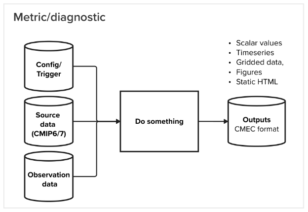
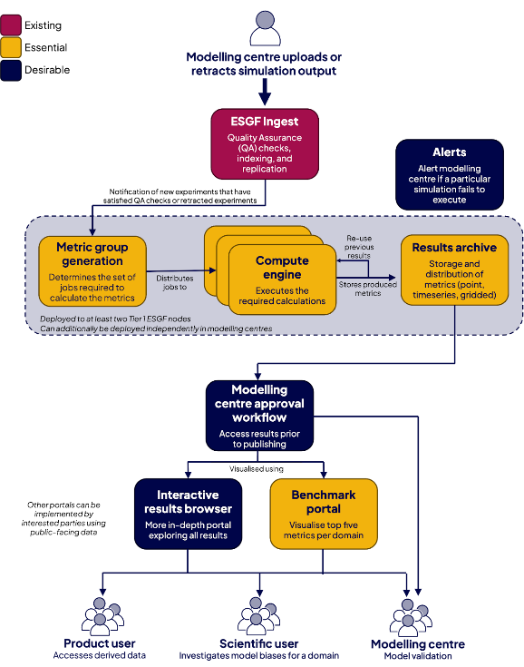
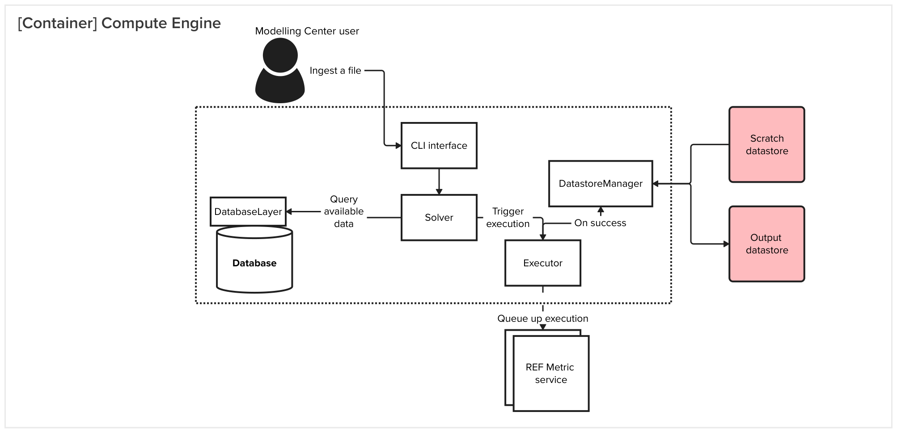
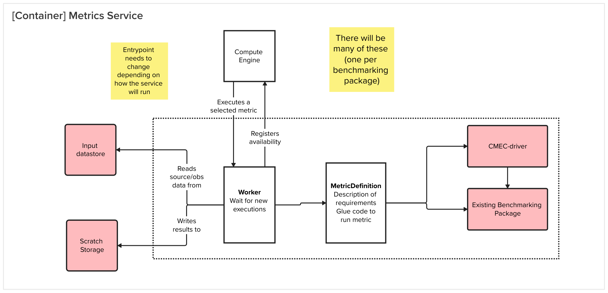
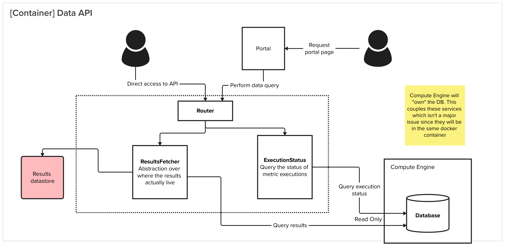

# Architecture

The CMIP AR7 Fast Track REF aims to provide a community tool for the benchmarking of Earth System Models (ESMs)
against observational datasets as they are submitted.
This near-real-time model evaluation will produce a set of scalar,
timeseries or gridded diagnostics in combination with static web pages and figures that will be made publicly available.

The CMIP7 Model Benchmarking Task Team (MBTT) has identified an initial set of metrics
that will be implemented using existing benchmarking packages.
The REF will improve the availability of,
and global access to,
evaluated simulations as well as supporting community efforts to reduce the carbon footprint.
Certain emergent characteristics – such as climate sensitivity, ECS (Equilibrium Climate Sensitivity),
TCRE (Transient Climate Response to Cumulative Emissions), and others –
could be pre-computed in a standardised manner supporting users including IPCC author teams.

This document outlines the some key design principles for the Rapid Evaluation Framework (REF) for the CMIP7 FastTrack (CMIP7 FT) process,
with an eye towards a scalable solution.

## System Architecture

At the heart of the REF is the ability to perform an operation when a given input dataset is changed
and to track the results of that execution (Figure 1).
The benchmarking providers define a set of metrics,
each metric has an associated data request that defines the input datasets required to perform the operation.

As new datasets are ingested into the system,
the REF will "solve" for which metrics need to be executed based on the data requirements of the metrics.
Each metric may produce multiple metric executions depending how it is configured.
The framework is agnostic to what operation is performed and (somewhat) what output is produced.
The external benchmarking packages provide the operations.

The REF is responsible for tracking the state of the system and ensuring that the correct operations are performed.
The REF will also provide a set of CLI commands to allow users to interact with the system and to retrieve the results of the operations.

/// caption
Figure 1: A metric in the REF context takes a set of input datasets and produces a set of outputs.
The output could include scalar values, timeseries, or gridded diagnostics as well as static figures or HTML.
///

## Objectives

The key objectives that determine the design of the system are as follows:

* **Modular:** This is a community project.
    It should be easy for existing and future benchmarking packages to integrate with the framework.
    The developer experience for the benchmarking package providers should be paramount.
* **Scalable:** For CMIP7-FT we are focusing on a small subset of possible derived metrics and diagnostics.
    The metrics will scale over time as the science progresses in terms of data volume and complexity.
* **Reusable:** We are targeting multiple different deployment environments and a range of different potential users.
    Where possible, we should preserve the ability to reuse components of the REF in different contexts.

### Assumptions

* Incoming CMIP source data has had basic quality assurance checks performed upon it.
    No metadata fixes will be able to be performed on the incoming datasets
    since this is intended to be run as new CMIP7 datasets are submitted.
* To speed up development, we are focussing on only monthly data.
    This greatly reduces the data volumes that we need to deal wit, lowering the systems requirement for using the REF.
* The benchmarking packages already provide the metrics that are targeted in the REF beta.
    We are working with an understanding of what those packages require.

### Quality

* Transparency: Open source, well-documented code
* Auditablility: Results should include provenance information
* Robustness: comprehensive test suite identifies any inconsistencies early in development

### Constraints

* We cannot control the deployment environment in Modelling Centers, so we must provide multiple different ways of running the REF.
* Different users will have different areas of interest which drives the ability to run the REF locally, rather than a centralised application.
* The development should be Python-based to be accessible to the wider research community.

### Design Principles
Some of the key design principles that were used when designing this system include:

* **Separation of Concerns:** Dividing components based on distinct responsibilities.
    The result should be a better experience for the benchmarking package developers as in-depth knowledge of only a subset of the system is required.
* **Resilience:** Designing for fault tolerance and graceful degradation.
    This will be a public-facing system so care must be taken to ensure that one bad input dataset doesn’t cause a cascading failure.

## System Context Diagram

The context diagram below (Figure 2) provides a high-level overview of the REF system and how it interacts with the external world.
This particular diagram was drafted during a meeting with the MB TT as the initial concept of some of the key components in the REF.
For the CMIP7-FT implementation,
we are focussing on the delivery of the essential components (yellow).
There are some additional desirable components that may be touched on through the lifecycle of the project but are not described here.

/// caption
Figure 2: A metric in the REF context takes a set of input datasets and produces a set of outputs.
The output could include scalar values, timeseries, or gridded diagnostics as well as static figures or HTML.
///

A breakdown of the components that make up the REF is shown in Figure 3.
Each blue component describes a service that will be deployed separately
(either as a docker container or a separate process) when deploying the system in a production release.

One of the aims of the system is to be flexible to the different needs of a wide userbase.
To that end, not all of the components would need to be installed for a usable system.
For example, some users may wish to run the system headless, i.e. without the data API and the portal.
Those users would still be able to access the artifacts directly from the file system.

Each benchmarking package that is contributing to the REF (the term Provider is used in the codebase)
will operate a separate service exposing the metrics/diagnostics that are supported.
These metrics all share a common interface that exposes all the information needed to call their own benchmarking packages.
This provides flexibility to update provider services independently,
and for users to implement their own if they have particular use cases.

Another differentiation to support would be where new local input data are ingested using the CLI, rather than from ESGF events.
This would be the likely mechanism for modelling centers wishing to test their data before submitting their data to ESGF.

/// caption
Figure 3:  Key components identified that form the REF along with some potential touch points by users.
The touchpoints are not exhaustive and additional flows will be identified as activity diagrams as they are fleshed out.
///

## Component Diagram
The sections below provide some additional detail for the key components shown in the Systems Context Diagram (Figure 3).

### Compute Engine

/// caption
Figure 4:  Compute Engine - responsible for tracking input data and metric executions
///

The compute engine is responsible for orchestrating the workflow to execute metrics.
It will be executed either via a CLI tool.
The compute engine will track the results that have been previously run in a database (SQLite by default).

The solver at the core of the compute engine will use the requirements from the defined metrics,
the available data sources and existing metrics to determine what additional metrics need to be executed.
The actual execution of the metric will be delegated to the metrics services.

This component will include a few key abstractions to ensure that multiple different target environments are able to be supported.
This allows the framework to retain some flexibility in places that we know will change between environments.

These abstractions include:

-	[Executor][cmip_ref_core.executor.Executor] - Allows for different task execution styles to be used
-	[Database][cmip_ref.database.Database] - Enables switching between different databases, and keeps the database layer separate from the rest of the code
-	DatastoreManager - The underlying datastores may be POSIX file systems or S3-compatible object stores

### Metrics service

/// admonition | Packaging

The metrics provider packages are named `cmip_ref_metrics-*` and are available on PyPI.
These REF-related packages are generally pretty lightweight and may not include the actual benchmarking code.
The benchmarking code is expected to be in a separate package that is installed as a dependency,
depending on how the REF will be deployed.

The section below describes how a non-local deployment of the REF looks like.
For in-process execution, the metric can be called directly.
///

The metric provider service will be responsible for performing metric calculations out-of-process
and returning the results to the compute engine.
Most of the business logic for the calculation of a metric will use the existing benchmarking packages.

/// caption
Figure 5:  Metric Service for remotely executing metrics
///

The worker component is the entrypoint of the service and is responsible for routing the metric request to the appropriate function.
The form of the worker component will depend on which execution pattern is used.
Possible patterns include a long-lived worker which pulls jobs from a queue if Celery is selected
or a simple wrapper in the case where each execution is a Slurm job on an HPC.

Each metrics service will be a separate docker container in the production deployment.
The virtual environment required to run each of the metrics packages will be different
and separating the environments provides greater control to the metric package maintainers.
Decoupling these environments makes it easy to update each metrics package independently.

### Data API

/// caption
Figure 6:  Data API - serves results to users
///

The Data API service is the main interface that the public will interact with.
This API will be read-only for CMIP7 FT implementation which greatly simplifies the complexity and controls that need to be in place.

This API will report information about the executed metrics and the results of those metrics.
The API will be used by the portal to display the results of the metrics and to allow users to download the results.
