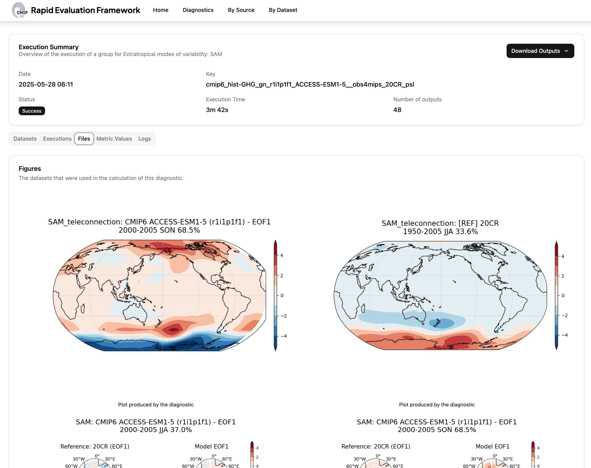

# Visualise Results

Once your diagnostics have completed,
the results are stored on disk in the specified results directory.


## Accessing results

These results are organised in folders by provider, diagnostic, execution group, and the hash of the datasets.

```bash
ls -d $REF_CONFIGURATION/results/*/*/*/
```

Each execution group will have its own subfolder containing metric output files (NetCDF, CSV, PNG, etc.) for a
specific execution.

The contents of this result directory depends on the diagnostic that was run, but typically includes:

* __output.json__: A CMEC Output bundle containing links to other output files such as NetCDF, CSV, and PNG files.
* __diagnostic.json__: A CMEC Metric bundle containing the scalar metric values
* __out.log__: The log output captured during the execution of the diagnostic
    (there may be additional provider-specific log files as well)

## Querying metrics with Python

We are working on a Python package to make it easier to query and visualize results programmatically.

## Web dashboard

An interactive dashboard is available via the REF web application (API + frontend).
This application allows you to explore results, visualize metrics, and generate plots:

- GitHub repo: [https://github.com/Climate-REF/ref-app](https://github.com/Climate-REF/ref-app)
- Live demo screenshot below:




## Next steps

You’ve now completed the Getting Started tutorials.
For advanced usage and customization, see the [How-to guides](../how-to-guides/index.md)
or the [Further background](../background/architecture.md) sections.
