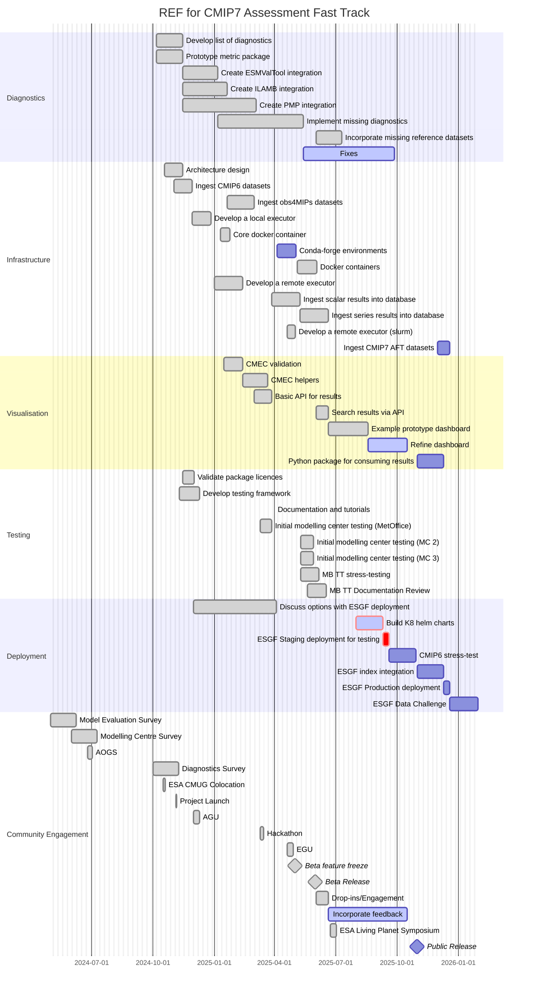

# Roadmap

Below is a high-level roadmap for the CMIP7 Assessment Fast Track(AFT)  project towards the goal of a public release in October 2025.
This roadmap outlines the key milestones and tasks that need to be completed to achieve this goal.

We have broken down the roadmap into several sections to provide a clear overview of the project's progress.
Namely,

- Diagnostics
- Infrastructure
- Visualisation
- Testing
- Deployment
- Community Engagement

The roadmap is subject to change as the project progresses, and adjustments may be made based on new insights, feedback, and evolving project requirements.

/// admonition | Note

Click on [] in the top right corner of the diagram to make it full screen.
///

## Diagnostics

An overview of the current state of the selected diagnostics can be found in the
[Diagnostics Github board](https://github.com/orgs/Climate-REF/projects/2/views/2) document.
This is being updated as the new metrics are integrated into the CMIP7 AFT REF.

## What will be in the public v1 release:

We have a public release planned for October 2025 during the ESM2025 General Assembly.
This will mark version 1.0 of the CMIP7 AFT REF and be hosted by the Earth System Grid Federation (ESGF).

This release will include diagnostic outputs from ESMValTool, PMP and ILAMB3 calculated from CMIP6 and CMIP6plus
datasets. Users will also be able to host their own instance of the REF to run diagnostics on datasets not available
on ESGF.

The release will include the following features:

* Ingesting local CMIP6, CMIP7 AFT, obs4MIPs datasets
    * We will include documentation to allow users to ingest their own datasets (we welcome any contributions)
* ESMValTool, ILAMB, and PMP metrics diagnostics
* A public web interface to view the results of any metrics executions
* A portrait plot contains results from the 3 different providers
* The ability to run metrics locally, using docker containers (via celery) and via Slurm.
* Documentation and tutorials

### What is not planned to be in the beta

* CMIP7 AFT datasets - this is waiting on datasets being available
* Integration with the ESGF indexes - that work is planned for after the release
* A python API to consume the results easily (results can be downloaded from the web interface)
* conda-forge packages for the metrics providers
