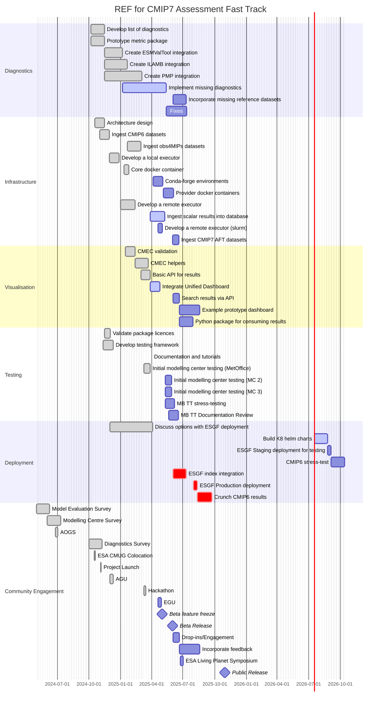

# Roadmap

Below is a high-level roadmap for the CMIP7 Assessment Fast Track(AFT)  project towards the goal of a public release in October 2025.
This roadmap outlines the key milestones and tasks that need to be completed to achieve this goal.

We have broken down the roadmap into several sections to provide a clear overview of the project's progress.
Namely,

- Diagnostics
- Infrastructure
- Visualisation
- Testing
- Deployment
- Community Engagement

The roadmap is subject to change as the project progresses, and adjustments may be made based on new insights, feedback, and evolving project requirements.

/// admonition | Note

Click on [] in the top right corner of the diagram to make it full screen.
///

## Diagnostics

An overview of the current state of the selected diagnostics can be found in the
[Diagnostics Github board](https://github.com/orgs/Climate-REF/projects/2/views/2) document.
This is being updated as the new metrics are integrated into the CMIP7 AFT REF.

## What will be in the beta:

We have a beta planned for release at the end of May 2025.
This beta is targeted at allowing the modelling community to test the metrics and provide feedback,
before a public release in October 2025 which will be deployed at ESGF.

The beta will include the following features:

* Ingesting local CMIP6, CMIP7 AFT, obs4MIPs datasets
    * We will include documention to allow users to ingest their own datasets (we welcome any contributions)
* Examples of ESMValTool, ILAMB, and PMP metrics.
    * Some reference datasets may be missing as we are work through integrating these with obs4MIPs.
* A simple web interface to view the results of any metrics executions locally
* A portrait plot contains results from the 3 different providers
* The ability to run metrics locally, using docker containers (via celery) and via Slurm.
* conda-forge packages for the metrics providers
* Documentation and tutorials

### What is not planned to be in the beta

* Integration with the ESGF indexes - that work is planned for after the beta release
* A publicly available API/website/set of results
  * A private staging deployment is expected by then, but this is for testing purposes only.
* Singularity containers (we welcome any contributions)
* A python API to consume the results easily (results will be available as local files)
* Alerts for when metrics fail
